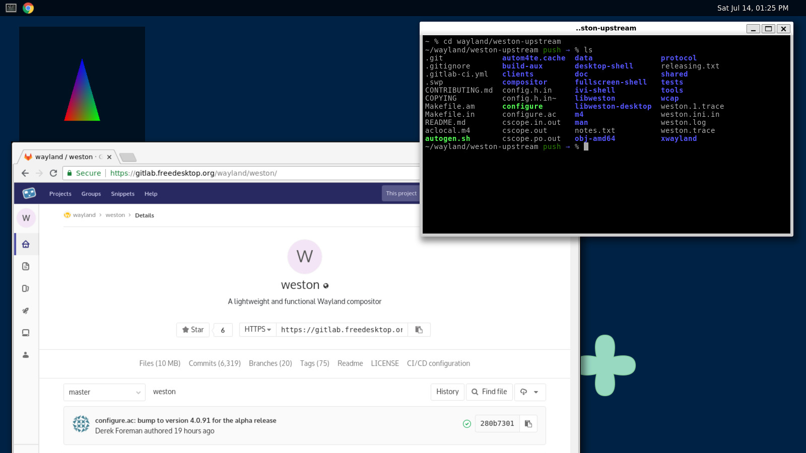
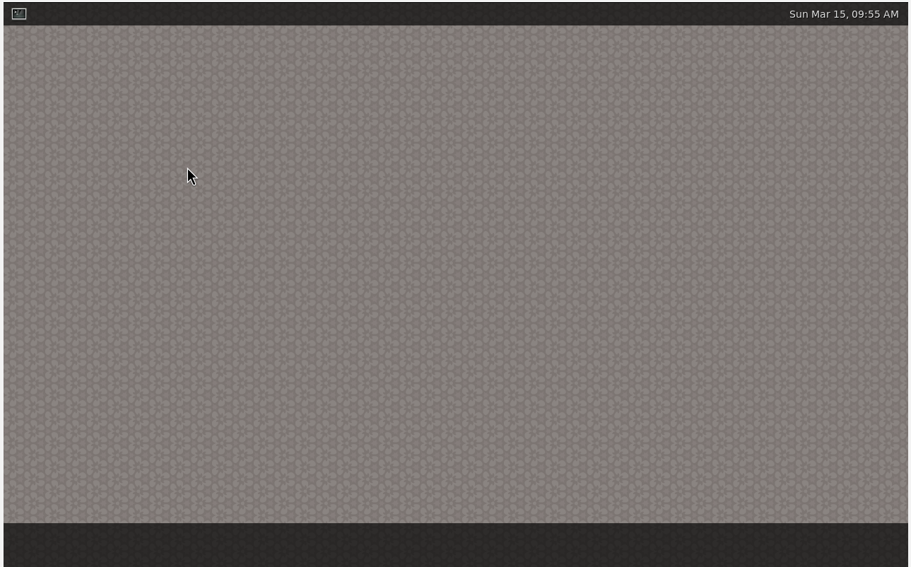

# Mywaydesk

## Introduction

Mywaydesk is a Wayland desktop environment derived from Weston. It is a WIP (Work in process).
Currently, it is based on Weston 14.0.2.

## Changes
Added a dock at the bottom (now it is empty, and more functions will be implemented in the future).

The original desktop screenshot (by original contributors):


The modified desktop:


## Installation
1. Install Debian 13 in a virtual machine (command line, without GUI)
2. Install dependencies of libweston
```
sudo apt build-dep libweston
```
3. Clone MyWaydesk's source code
4. Build and install
```
meson setup build
ninja -C build
sudo ninja -C build install
```

## License
This project uses the same license as Weston. For more information, read `COPYING`.

## Acknowledgement
This project is derived from:
https://gitlab.freedesktop.org/wayland/weston

Thanks to the original authors and contributors.